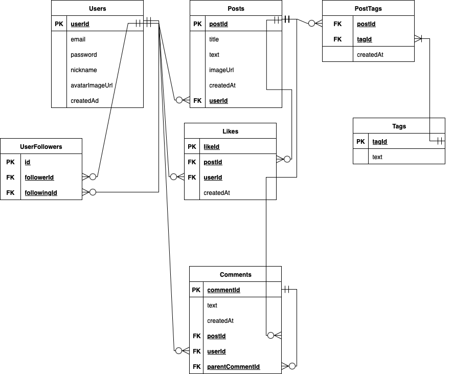

# DataBase-Lab1

## Схема бази даних

### Таблиця Users (Користувачі)
| Поле | Тип/Примітка |
| :--- | :--- |
| **userId** |  PK (первинний ключ) |
| **email** | email користувача |
| **password** | пароль користувача |
| **nickname** | нікнейм користувача |
| **avatarImageUrl** | URL аватара користувача |
| **createdAt** | Дата створення облікового запису |

*Примітки*: Основна таблиця. Кожен користувач має унікальний `userId`.

### Таблиця Posts (Пости)
| Поле | Тип/Примітка |
| :--- | :--- |
| **postId** |  PK (первинний ключ) |
| **title** | заголовок посту |
| **text** | текст посту |
| **imageUrl** | URL зображення |
| **createdAt** | дата створення посту |
| **userId** |  FK → Users.userId |

*Примітки*: Кожен пост належить **одному користувачу**.

### Таблиця Comments (Коментарі)
| Поле | Тип/Примітка |
| :--- | :--- |
| **commentId** |  PK (первинний ключ) |
| **text** | текст коментаря |
| **createdAt** | дата створення коментаря |
| **postId** |  FK → Posts.postId |
| **userId** |  FK → Users.userId |
| **parentCommentId** |  FK → Comments.commentId (**NULLable**) |

*Примітки*: Підтримує **ієрархічні коментарі** (відповіді на коментарі). `parentCommentId = NULL` для кореневих коментарів.

### Таблиця Likes (Лайки)
| Поле | Тип/Примітка |
| :--- | :--- |
| **likeId** |  PK (первинний ключ) |
| **postId** |  FK → Posts.postId |
| **userId** |  FK → Users.userId |
| **createdAt** | дата створення лайка |

*Примітки*: Реєструє лайки на постах. **Унікальна комбінація** (`userId`, `postId`).

### Таблиця Tags (Теги)
| Поле | Тип/Примітка |
| :--- | :--- |
| **tagId** |  PK (первинний ключ) |
| **text** | назва тегу |

*Примітки*: Зберігає список доступних тегів. Зв'язок із постами через таблицю `PostTags`.

### Таблиця PostTags (Зв'язок пост-тег)
| Поле | Тип/Примітка |
| :--- | :--- |
| **postId** |  FK → Posts.postId |
| **tagId** |  FK → Tags.tagId |

*Примітки*: **Проміжна таблиця** для зв'язку **багато-до-багатьох** (**M:N**) між постами та тегами.

### Таблиця UserFollowers (Підписки)
| Поле | Тип/Примітка |
| :--- | :--- |
| **id** | PK (первинний ключ) |
| **followerId** | FK → Users.userId (той, хто підписаний) |
| **followingId** | FK → Users.userId (той, на кого підписались) |

*Примітки*: Відображає зв'язки **M:N** між користувачами (**система підписок**).

---

## 🔗 Відносини між таблицями

| Відношення | Тип | Реалізація |
| :--- | :--- | :--- |
| **Users → Posts** | **1:N** | `Posts.userId` (FK, NOT NULL) |
| **Users → Comments** | **1:N** | `Comments.userId` (FK, NOT NULL) |
| **Posts → Comments** | **1:N** | `Comments.postId` (FK, NOT NULL) |
| **Comments → Comments** | **1:N** | `Comments.parentCommentId` (FK, NULLable) |
| **Posts ↔ Tags** | **M:N** | Проміжна таблиця `PostTags` |
| **Users ↔ Users** | **M:N** | Таблиця `UserFollowers` |
| **Posts ↔ Users** (через Likes) | **M:N** | Таблиця `Likes` |

---

## 📊 Діаграма відносин (текстова)
```text
Users (1) ←→ (N) Posts
  ↑                  ↑
  │                  │
 (N)                (N)
  │                  │
  ↓                  ↓
Comments ←------ Likes
  ↑
  │
 (N) (self-reference, NULLable)
  │
  ↓
Comments (child comments)

```

**Висновок:**  
- Структура бази даних дозволяє зберігати користувачів, їхні пости, лайки, коментарі, теги та підписки.  
- Зовнішні ключі та проміжні таблиці гарантують цілісність даних.  
- База придатна для соціальної мережі або блогу.

---

**Верезей Ілля ІМ - 42**


