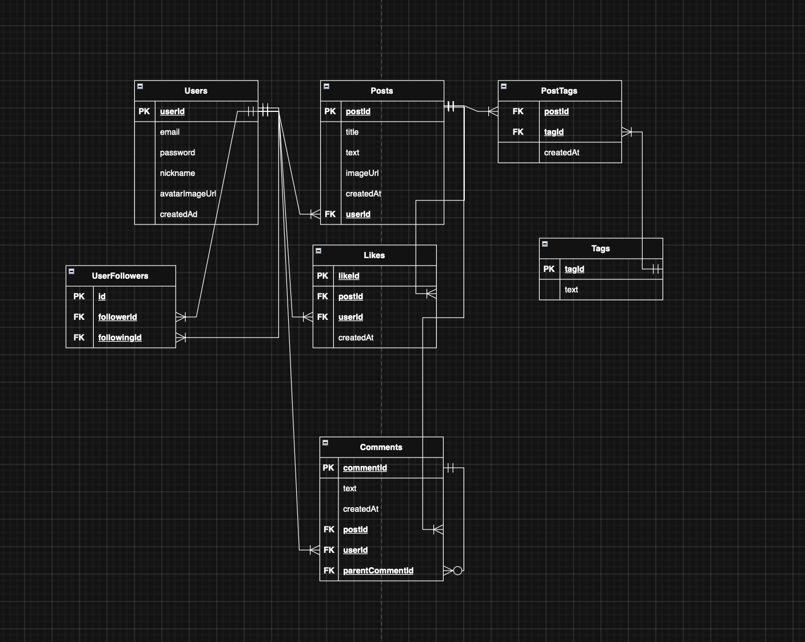

# Лабораторна робота 2  
**Тема:** Перетворення ER-діаграми на реляційну схему в PostgreSQL  

---

## Схема бази даних

### Таблиця `users`
- **Стовпці:**  
  - `userId SERIAL PRIMARY KEY` — унікальний ідентифікатор користувача  
  - `email CITEXT NOT NULL` — електронна пошта, обов’язкова  
  - `password VARCHAR NOT NULL` — пароль користувача  
  - `nickname VARCHAR(16) NOT NULL` — нікнейм користувача  
  - `avatarImageUrl VARCHAR` — URL аватарки  
  - `createdAt TIMESTAMP WITH TIME ZONE DEFAULT NOW()` — дата створення  
- **Обмеження:** `PRIMARY KEY`, `NOT NULL`, `CHECK` для формату email  

### Таблиця `userFollowers`
- **Стовпці:**  
  - `id SERIAL PRIMARY KEY`  
  - `followerId INT NOT NULL` — FK → `users(userId)`  
  - `followingId INT NOT NULL` — FK → `users(userId)`  
- **Обмеження:**  
  - `UNIQUE(followerId, followingId)` — унікальність підписки  
  - `CHECK(followerId <> followingId)` — заборона підписки на самого себе  
  - `ON DELETE CASCADE` для FK  

### Таблиця `posts`
- **Стовпці:**  
  - `postId SERIAL PRIMARY KEY`  
  - `userId INT NOT NULL` — FK → `users(userId)`  
  - `title VARCHAR NOT NULL`  
  - `text TEXT`  
  - `imageUrl VARCHAR`  
  - `createdAt TIMESTAMP WITH TIME ZONE DEFAULT NOW()`  
- **Обмеження:** FK з `ON DELETE CASCADE`  

### Таблиця `likes`
- **Стовпці:**  
  - `likeId SERIAL PRIMARY KEY`  
  - `postId INT NOT NULL` — FK → `posts(postId)`  
  - `userId INT NOT NULL` — FK → `users(userId)`  
  - `createdAt TIMESTAMP WITH TIME ZONE DEFAULT NOW()`  
- **Обмеження:**  
  - `UNIQUE(userId, postId)` — один лайк від користувача на пост  
  - `ON DELETE CASCADE`  

### Таблиця `comments`
- **Стовпці:**  
  - `commentId SERIAL PRIMARY KEY`  
  - `postId INT NOT NULL` — FK → `posts(postId)`  
  - `userId INT NOT NULL` — FK → `users(userId)`  
  - `parentCommentId INT NULL` — FK → `comments(commentId)`  
  - `text TEXT NOT NULL`  
  - `createdAt TIMESTAMP WITH TIME ZONE DEFAULT NOW()`  
- **Обмеження:** FK з `ON DELETE CASCADE` для всіх зовнішніх ключів  
- **Особливість:** parentCommentId може бути NULL → зв’язок опціональний (кружечок на ER-діаграмі)  

### Таблиця `tags`
- **Стовпці:**  
  - `tagId SERIAL PRIMARY KEY`  
  - `text VARCHAR(16) NOT NULL UNIQUE`  

### Таблиця `postTags`
- **Стовпці:**  
  - `postId INT NOT NULL` — FK → `posts(postId)`  
  - `tagId INT NOT NULL` — FK → `tags(tagId)`  
- **Обмеження:** `ON DELETE CASCADE`  

---

## Тестові дані

### users
```sql
INSERT INTO users (email, password, nickname, avatarImageUrl) VALUES
('olena@example.com', 'pass123', 'Olena', 'https://example.com/avatar1.png'),
('ivan@example.com', 'pass456', 'Ivan', 'https://example.com/avatar2.png');
```

## userFollowers
```sql
INSERT INTO userFollowers (followerId, followingId) VALUES
(1, 2);
posts
INSERT INTO posts (userId, title, text, imageUrl) VALUES
(1, 'Test post title', 'content test', 'https://example.com/avatar1.png'),
(2, 'Another post', 'second post content', 'https://example.com/avatar2.png');
likes
INSERT INTO likes (postId, userId) VALUES
(1, 1),
(2, 2);
comments
INSERT INTO comments (postId, userId, text) VALUES
(1, 1, 'Test comment'),
(2, 2, 'Test comment2');
tags
INSERT INTO tags (text) VALUES
('TESTTAG');
postTags
INSERT INTO postTags (postId, tagId) VALUES
(1, 1);
```

**Верезей Ілля ІМ - 42**


