# DataBase-Lab4

## Схема бази даних

### Таблиця Users (Користувачі)
| Поле | Тип/Примітка |
| :--- | :--- |
| **userId** |  PK (первинний ключ) |
| **email** | email користувача |
| **password** | пароль користувача |
| **nickname** | нікнейм користувача |
| **avatarImageUrl** | URL аватара користувача |
| **createdAt** | Дата створення облікового запису |

*Примітки*: Основна таблиця. Кожен користувач має унікальний `userId`.

### Таблиця Posts (Пости)
| Поле | Тип/Примітка |
| :--- | :--- |
| **postId** |  PK (первинний ключ) |
| **title** | заголовок посту |
| **text** | текст посту |
| **imageUrl** | URL зображення |
| **createdAt** | дата створення посту |
| **userId** |  FK → Users.userId |

*Примітки*: Кожен пост належить **одному користувачу**.

### Таблиця Comments (Коментарі)
| Поле | Тип/Примітка |
| :--- | :--- |
| **commentId** |  PK (первинний ключ) |
| **text** | текст коментаря |
| **createdAt** | дата створення коментаря |
| **postId** |  FK → Posts.postId |
| **userId** |  FK → Users.userId |
| **parentCommentId** |  FK → Comments.commentId (**NULLable**) |

*Примітки*: Підтримує **ієрархічні коментарі** (відповіді на коментарі). `parentCommentId = NULL` для кореневих коментарів.

### Таблиця Likes (Лайки)
| Поле | Тип/Примітка |
| :--- | :--- |
| **likeId** |  PK (первинний ключ) |
| **postId** |  FK → Posts.postId |
| **userId** |  FK → Users.userId |
| **createdAt** | дата створення лайка |

*Примітки*: Реєструє лайки на постах. **Унікальна комбінація** (`userId`, `postId`).

### Таблиця Tags (Теги)
| Поле | Тип/Примітка |
| :--- | :--- |
| **tagId** |  PK (первинний ключ) |
| **text** | назва тегу |

*Примітки*: Зберігає список доступних тегів. Зв'язок із постами через таблицю `PostTags`.

### Таблиця PostTags (Зв'язок пост-тег)
| Поле | Тип/Примітка |
| :--- | :--- |
| **postId** |  FK → Posts.postId |
| **tagId** |  FK → Tags.tagId |

*Примітки*: **Проміжна таблиця** для зв'язку **багато-до-багатьох** (**M:N**) між постами та тегами.

### Таблиця UserFollowers (Підписки)
| Поле | Тип/Примітка |
| :--- | :--- |
| **id** | PK (первинний ключ) |
| **followerId** | FK → Users.userId (той, хто підписаний) |
| **followingId** | FK → Users.userId (той, на кого підписались) |

*Примітки*: Відображає зв'язки **M:N** між користувачами (**система підписок**).

---

## 🔗 Відносини між таблицями

| Відношення | Тип | Реалізація |
| :--- | :--- | :--- |
| **Users → Posts** | **1:N** | `Posts.userId` (FK, NOT NULL) |
| **Users → Comments** | **1:N** | `Comments.userId` (FK, NOT NULL) |
| **Posts → Comments** | **1:N** | `Comments.postId` (FK, NOT NULL) |
| **Comments → Comments** | **1:N** | `Comments.parentCommentId` (FK, NULLable) |
| **Posts ↔ Tags** | **M:N** | Проміжна таблиця `PostTags` |
| **Users ↔ Users** | **M:N** | Таблиця `UserFollowers` |
| **Posts ↔ Users** (через Likes) | **M:N** | Таблиця `Likes` |

---

## 📊 Діаграма відносин (текстова)
```text
Users (1) ←→ (N) Posts
  ↑                  ↑
  │                  │
 (N)                (N)
  │                  │
  ↓                  ↓
Comments ←------ Likes
  ↑
  │
 (N) (self-reference, NULLable)
  │
  ↓
Comments (child comments)

```

## Команди та фото

**COUNT:**  

```sql
-- Знайдемо число користувачів без аватарки

SELECT COUNT(*) AS UsersWithoutAvatar
FROM users
WHERE avatarImageUrl IS null;
```

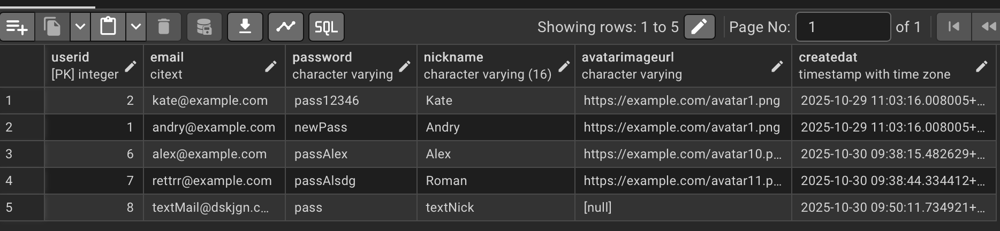

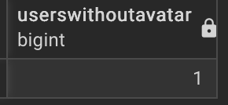

**SUM:**  

```sql
-- Знайдемо сумму лайків 

SELECT userId, SUM(1) AS totalLikes
FROM likes
GROUP BY userId;
```
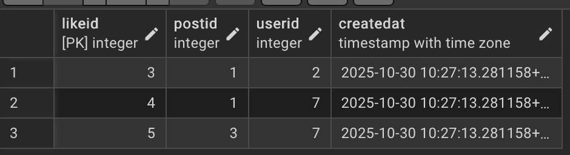

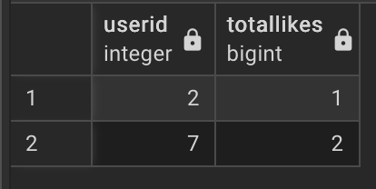

**AVG:**  
```sql
-- Середня кількість лайків на пост
SELECT AVG(like_count) AS avg_likes_per_post
FROM (
    SELECT postId, COUNT(*) AS like_count
    FROM likes
    GROUP BY postId
) AS counts;
```

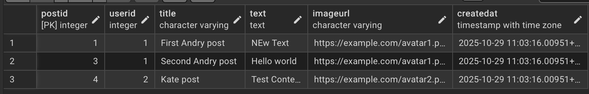

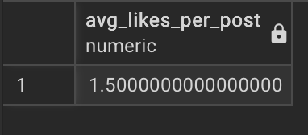

**MIN:** 

```sql

-- Найраніший пост у базі
SELECT MIN(createdAt) AS first_post_date
FROM posts;
```


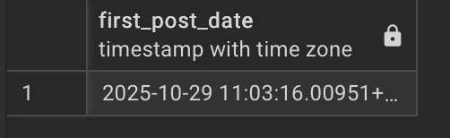


**GROUP BY:** 
```sql
-- Кількість підписників у кожного користувача

SELECT followingId, COUNT(*) AS total_followers
FROM userFollowers
GROUP BY followingId;
```

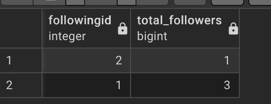

**INNER JOIN:** 
```sql
-- Users + posts

SELECT email, nickname, postId, title, text
FROM users
JOIN posts ON users.userId = posts.userId
```


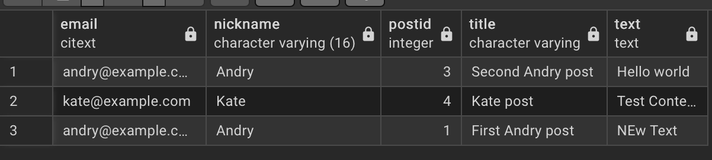

**LEFT JOIN:** 
```sql
-- Users + posts (left join)

SELECT email, nickname, postId, title, text
FROM users
JOIN posts ON users.userId = posts.userId
```


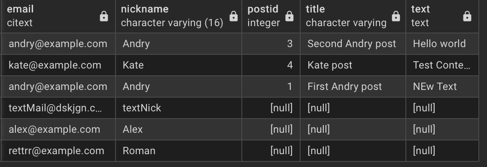

**RIGHT JOIN:** 
```sql
-- Users + posts (right join)

SELECT email, nickname, postId, title, text
FROM posts
RIGHT JOIN users ON posts.userId = users.userId
```


**FULL JOIN:** 
```sql
-- Full join (user + likes)

SELECT users.userId, nickname, likes
FROM users
FULL JOIN likes ON users.userId = likes.userId;
```


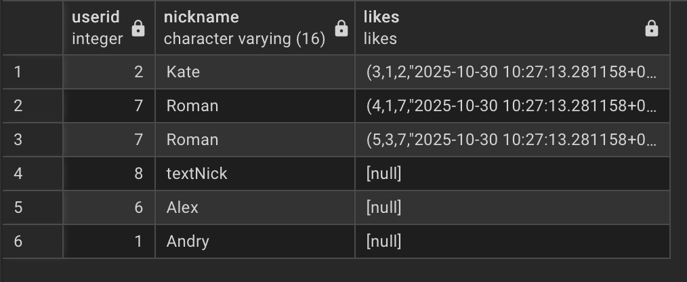

**CROSS JOIN:** 
```sql
-- CROSS join (user + posts)

SELECT users.nickname, posts.text
FROM users
CROSS JOIN posts;

```


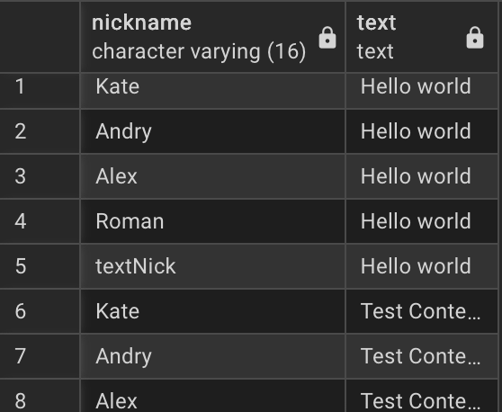

**Having:** 

```sql
-- Having

SELECT userId, COUNT(*) AS total_posts
FROM posts
GROUP BY userId
HAVING COUNT(*) > 1;
```
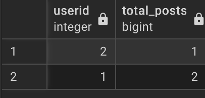
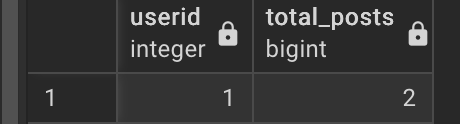


**Верезей Ілля ІМ - 42**

