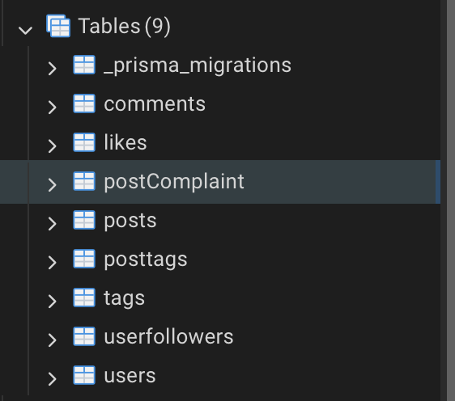
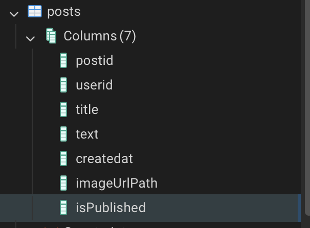
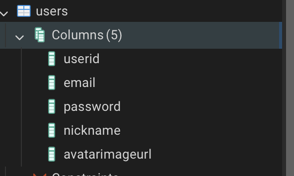

# Лабораторна робота 5 

**Верезей Ілля ІМ - 42**

**1. Додавання нової таблиці**
До:
```prisma
model users {
  userid                                         Int             @id @default(autoincrement())
  email                                          String          @unique(map: "uq_users_email") @db.Citext
  password                                       String          @db.VarChar
  nickname                                       String          @db.VarChar(16)
  avatarimageurl                                 String?         @db.VarChar
  createdat                                      DateTime?       @default(now()) @db.Timestamptz(6)
  comments                                       comments[]
  likes                                          likes[]
  posts                                          posts[]
  userfollowers_userfollowers_followeridTousers  userfollowers[] @relation("userfollowers_followeridTousers")
  userfollowers_userfollowers_followingidTousers userfollowers[] @relation("userfollowers_followingidTousers")
}

model posts {
  postid    Int        @id @default(autoincrement())
  userid    Int
  title     String     @db.VarChar
  text      String?
  imageurl  String?    @db.VarChar
  createdat DateTime?  @default(now()) @db.Timestamptz(6)
  comments  comments[]
  likes     likes[]
  users     users      @relation(fields: [userid], references: [userid], onDelete: Cascade, onUpdate: NoAction)
  posttags  posttags[]
}
```
Після:
```prisma
enum ComplaintStatus {
  PENDING
  REVIEWED
  REJECTED
}

model postComplaint {
  postComplaintId Int             @id @default(autoincrement())
  userid          Int
  postid          Int
  status          ComplaintStatus @default(PENDING)
  createdat       DateTime?       @default(now()) @db.Timestamptz(6)

  users           users           @relation(fields: [userid], references: [userid], onDelete: Cascade, onUpdate: NoAction)
  posts           posts           @relation(fields: [postid], references: [postid], onDelete: Cascade, onUpdate: NoAction)

  @@unique([userid, postid])
}

model users {
  userid                                         Int             @id @default(autoincrement())
  email                                          String          @unique(map: "uq_users_email") @db.Citext
  password                                       String          @db.VarChar
  nickname                                       String          @db.VarChar(16)
  avatarimageurl                                 String?         @db.VarChar
  createdat                                      DateTime?       @default(now()) @db.Timestamptz(6)
  comments                                       comments[]
  likes                                          likes[]
  posts                                          posts[]
  userfollowers_userfollowers_followeridTousers  userfollowers[] @relation("userfollowers_followeridTousers")
  userfollowers_userfollowers_followingidTousers userfollowers[] @relation("userfollowers_followingidTousers")
  postComplaint postComplaint[]
}

model posts {
  postid    Int        @id @default(autoincrement())
  userid    Int
  title     String     @db.VarChar
  text      String?
  imageurl  String?    @db.VarChar
  createdat DateTime?  @default(now()) @db.Timestamptz(6)
  comments  comments[]
  likes     likes[]
  users     users      @relation(fields: [userid], references: [userid], onDelete: Cascade, onUpdate: NoAction)
  posttags  posttags[]
  postComplaint postComplaint[]
}
```


**2. Заміна назви поля, та додавання нового**

До:
```prisma
model posts {
  postid       Int            @id @default(autoincrement())
  userid       Int
  title        String         @db.VarChar
  text         String?
  imageUrl     String?        @db.VarChar         
  createdat    DateTime?      @default(now()) @db.Timestamptz(6)
  comments     comments[]
  likes        likes[]
  users        users          @relation(fields: [userid], references: [userid], onDelete: Cascade, onUpdate: NoAction)
  posttags     posttags[]
  postComplaint postComplaint[]
}
```
Після:
```prisma
model posts {
  postid       Int            @id @default(autoincrement())
  userid       Int
  title        String         @db.VarChar
  text         String?
  imageUrlPath String?        @db.VarChar          
  isPublished  Boolean        @default(false)     
  createdat    DateTime?      @default(now()) @db.Timestamptz(6)
  comments     comments[]
  likes        likes[]
  users        users          @relation(fields: [userid], references: [userid], onDelete: Cascade, onUpdate: NoAction)
  posttags     posttags[]
  postComplaint postComplaint[]
}
```


**3. Видалення поля**

До:
```prisma
model users {
  userid                                         Int             @id @default(autoincrement())
  email                                          String          @unique
  password                                       String          @db.VarChar
  nickname                                       String          @db.VarChar(16)
  avatarimageurl                                 String?         @db.VarChar
  createdat                                      DateTime?       @default(now()) @db.Timestamptz(6)
  comments                                       comments[]
  likes                                          likes[]
  posts                                          posts[]
  userfollowers_userfollowers_followeridTousers  userfollowers[] @relation("userfollowers_followeridTousers")
  userfollowers_userfollowers_followingidTousers userfollowers[] @relation("userfollowers_followingidTousers")
  postComplaint postComplaint[]
}
```
Після:
```prisma
model users {
  userid                                         Int             @id @default(autoincrement())
  email                                          String          @unique
  password                                       String          @db.VarChar
  nickname                                       String          @db.VarChar(16)
  avatarimageurl                                 String?         @db.VarChar
  comments                                       comments[]
  likes                                          likes[]
  posts                                          posts[]
  userfollowers_userfollowers_followeridTousers  userfollowers[] @relation("userfollowers_followeridTousers")
  userfollowers_userfollowers_followingidTousers userfollowers[] @relation("userfollowers_followingidTousers")
  postComplaint postComplaint[]
}
```

